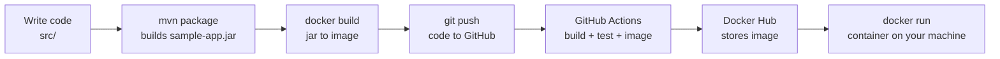

# sample-app — Guess the Number

A beginner-friendly end-to-end project: a small **Java** web game that is built with **Maven**, tested with **JUnit**, packaged into a **Docker** image, versioned with **Git**, built and tested automatically by **GitHub Actions**, published to **Docker Hub**, and finally run locally as a container.

The server picks a secret number between 1 and 100. The browser UI gives higher/lower hints, narrows the remaining range, counts attempts, and remembers your best score.

---

## 1. The big picture



Key idea: **source code → jar → image → container**.

- A **jar** is your compiled Java code in one zip-like file. It needs Java installed to run.
- An **image** is a read-only template: your jar *plus* a Java runtime *plus* a minimal Linux. It runs anywhere Docker runs.
- A **container** is a running instance of an image. One image can start many containers.

---

## 2. Project layout — what every file is for

```
Learn/
├── pom.xml                     Maven build file (dependencies + how to build)
├── Dockerfile                  Recipe for building the Docker image
├── docker-compose.yml          Shortcut for running the container with settings
├── .dockerignore               Files Docker should NOT copy into the build
├── .gitignore                  Files Git should NOT track
├── README.md                   This guide
├── .github/workflows/ci.yml    GitHub Actions pipeline (CI/CD)
├── src/main/java/com/example/
│   ├── App.java                HTTP server + API endpoints
│   └── Game.java               Game rules (the logic that gets tested)
├── src/main/resources/
│   └── index.html              The game frontend (HTML + CSS + JS)
└── src/test/java/com/example/
    └── GameTest.java           JUnit tests for Game.java
```

`target/` appears after a build — it holds compiled classes and `sample-app.jar`. It is generated, so it is listed in `.gitignore` and never committed.

### 2.1 `pom.xml` — the Maven build file

Maven is Java's build tool. Instead of compiling files by hand, you declare *what* you need and Maven does it. Important parts:

| Section | Meaning |
| --- | --- |
| `groupId` / `artifactId` / `version` | The project's unique ID: `com.example:sample-app:1.0.0` |
| `properties` → `maven.compiler.source/target` | Compile for Java 11 |
| `dependencies` | External libraries. Here only JUnit 5, with `<scope>test</scope>` so it is used for tests but **not** shipped in the jar |
| `finalName` | Names the output `target/sample-app.jar` instead of `sample-app-1.0.0.jar` |
| `maven-surefire-plugin` | Runs the tests in `src/test/java` |
| `maven-jar-plugin` → `mainClass` | Writes `Main-Class: com.example.App` into the jar manifest, which is what makes `java -jar` work |

Maven's standard folder convention matters: main code in `src/main/java`, static files in `src/main/resources`, tests in `src/test/java`. Anything in `resources` is bundled inside the jar — that's how `index.html` is served without existing as a separate file at runtime.

### 2.2 `Dockerfile` — how the image is built

It uses a **multi-stage build**: one stage compiles, a second stage keeps only what is needed to run. Result: a small, safer final image (no Maven, no source code, no compiler).

```dockerfile
# syntax=docker/dockerfile:1                  # enables BuildKit features (cache mounts)
FROM maven:3.9-eclipse-temurin-17 AS build   # stage 1: has Maven + JDK
WORKDIR /workspace                            # working folder inside the image
COPY pom.xml .                                # copy only pom first...
RUN --mount=type=cache,target=/root/.m2 \
    mvn -B -q dependency:resolve              # ...so dependencies are fetched and cached
COPY src ./src                                # now copy source (changes often)
RUN --mount=type=cache,target=/root/.m2 \
    mvn -B clean package                      # compile + test + build the jar

FROM eclipse-temurin:17-jre-alpine            # stage 2: only a JRE, tiny Alpine Linux
WORKDIR /app
RUN addgroup -S app && adduser -S app -G app  # create a non-root user
COPY --from=build /workspace/target/sample-app.jar app.jar   # take just the jar
USER app                                      # don't run as root (security)
EXPOSE 8080                                   # documents the port used
ENV PORT=8080                                 # default env var read by App.java
HEALTHCHECK ... wget http://localhost:8080/health   # Docker marks the container healthy/unhealthy
ENTRYPOINT ["java", "-jar", "app.jar"]        # the command run when the container starts
```

Why `COPY pom.xml` before `COPY src`? Docker caches each instruction as a **layer**. If only your source changed, the dependency layer is reused and the build is much faster.

`--mount=type=cache,target=/root/.m2` gives the build a persistent Maven repository that survives across builds, so jars are downloaded once instead of on every build. (Avoid `mvn dependency:go-offline` here — it resolves every plugin's full dependency tree and can take 15+ minutes.)

| Instruction | What it does |
| --- | --- |
| `FROM` | Base image to start from |
| `WORKDIR` | Sets the current directory for later instructions |
| `COPY` | Copies files from your machine (or an earlier stage) into the image |
| `RUN` | Executes a command **at build time**, saving the result in the image |
| `RUN --mount=type=cache` | Same, but with a folder that persists between builds (not stored in the image) |
| `ENV` | Sets an environment variable |
| `EXPOSE` | Documentation of the listening port (does not publish it) |
| `USER` | Which user later instructions and the app run as |
| `HEALTHCHECK` | Command Docker runs periodically to report healthy/unhealthy |
| `ENTRYPOINT` | The command executed **at run time** when the container starts |

### 2.3 `.dockerignore` and `.gitignore`

Both are exclusion lists, for different tools.

- `.dockerignore` — keeps `target/`, `.git/`, etc. out of the build context sent to the Docker daemon. Smaller context = faster builds and no stale local jars leaking into the image.
- `.gitignore` — keeps build output and IDE settings out of version control. You commit *sources*, never *artifacts*.

### 2.4 `docker-compose.yml` — running made easy

Compose describes containers in YAML so you don't retype long `docker run` flags. It also scales to multi-container setups (app + database + cache) later.

```yaml
services:
  app:
    build: .                 # build from the Dockerfile in this folder
    image: sample-app:local  # name the resulting image
    ports:
      - "8080:8080"          # hostPort:containerPort
    environment:
      PORT: 8080             # env var passed into the container
```

`docker compose up --build` replaces `docker build ... && docker run -p 8080:8080 ...`.

### 2.5 `.github/workflows/ci.yml` — the automation (CI/CD)

**CI** (Continuous Integration) = every push is automatically compiled and tested. **CD** (Continuous Delivery) = a passing build is automatically packaged and published.

The file lives in `.github/workflows/`; GitHub picks it up automatically.

| Block | Meaning |
| --- | --- |
| `on: push / pull_request` | Triggers: run on pushes to `main` and on PRs targeting `main` |
| `env: IMAGE_NAME` | A variable reused later as `${{ env.IMAGE_NAME }}` |
| `jobs:` | Independent units of work, each on a fresh `ubuntu-latest` VM |
| `steps:` | Ordered commands inside a job |
| `uses:` | Runs a reusable *action* published by someone else |
| `run:` | Runs a shell command |

**Job 1 — `build-and-test`**

1. `actions/checkout@v4` — clones your repo onto the runner (nothing else works without this).
2. `actions/setup-java@v4` — installs Temurin JDK 17; `cache: maven` caches `~/.m2` so later runs are faster.
3. `mvn -B clean verify` — compiles and runs all tests. A test failure fails the job and marks the commit/PR red.
4. `actions/upload-artifact@v4` with `if: always()` — saves the Surefire test reports even when tests fail, so you can download and inspect them.

**Job 2 — `docker`**

- `needs: build-and-test` — only starts if the tests passed.
- `if: github.event_name == 'push' && github.ref == 'refs/heads/main'` — only publish from `main`; pull requests build and test but never push an image.
- `docker/setup-buildx-action@v3` — enables BuildKit (better caching, multi-platform).
- `docker/login-action@v3` — logs in to Docker Hub using **secrets**, never plaintext passwords.
- `docker/build-push-action@v6` — builds and pushes two tags:
  - `:latest` — always the newest build
  - `:<commit sha>` — an immutable tag so you can roll back to an exact build
  - `cache-from/cache-to: type=gha` — reuses layers between runs via GitHub's cache.

`${{ secrets.X }}` values are stored encrypted in the repository settings and masked in logs.

---

## 3. The application code

### `Game.java` — the rules, kept separate on purpose

Holds `secret`, `max`, `attempts`, `solved`. `guess(int)` returns `TOO_LOW`, `TOO_HIGH`, or `CORRECT`, and throws `IllegalArgumentException` for out-of-range input.

It has **no HTTP code**, which is why it can be unit-tested in milliseconds. Separating logic from transport is a habit worth forming early.

### `App.java` — the HTTP layer

Uses the JDK's built-in `HttpServer` (no framework, no extra dependencies) and registers routes:

| Path | Purpose |
| --- | --- |
| `GET /` | Serves `index.html` from inside the jar |
| `POST /api/new` | Creates a game, returns `{"id":"<uuid>","max":100}` |
| `GET /api/guess?id=&value=` | Returns `{"result":"...","attempts":n,"solved":bool}` |
| `GET /health` | `{"status":"UP"}` — used by the Docker healthcheck |

Games are stored in a `ConcurrentHashMap` keyed by a random UUID, so two players never share state. State is in memory only: restart the container and games are gone.

### `index.html` — the frontend

Plain HTML/CSS/JavaScript, no build step. `fetch()` calls the API and updates the message, the narrowing Low/High range, the attempt counter, and the guess-history chips. The best score is kept in the browser's `localStorage`.

### `GameTest.java` — the tests

JUnit 5. `@Test` marks a test method; `assertEquals` / `assertTrue` / `assertThrows` check expectations. These run automatically during `mvn verify` and in CI — that is the "test" part of "build and test".

---

## 4. Every command, explained

### Maven

| Command | What it does |
| --- | --- |
| `mvn clean` | Deletes `target/` |
| `mvn compile` | Compiles `src/main/java` |
| `mvn test` | Compiles and runs the tests |
| `mvn package` | Runs tests and creates `target/sample-app.jar` |
| `mvn verify` | `package` plus any verification checks — what CI runs |
| `mvn clean verify` | Fresh build from scratch, the safest local check |
| `-B` | "Batch mode": no colour/progress spam, ideal for CI logs |
| `-o` | Offline: use only already-downloaded dependencies |

Run the app without Docker:

```bash
mvn clean verify
java -jar target/sample-app.jar     # then open http://localhost:8080
PORT=9090 java -jar target/sample-app.jar   # run on a different port
```

### Docker

| Command | What it does |
| --- | --- |
| `docker build -t sample-app:local .` | Builds an image from the `Dockerfile` in `.` and tags it `sample-app:local` |
| `docker images` | Lists local images |
| `docker run --rm -p 8080:8080 sample-app:local` | Starts a container; `-p host:container` publishes the port; `--rm` deletes it on exit |
| `docker run -d ...` | Detached: run in the background |
| `--name guess-game` | Gives the container a readable name |
| `-e PORT=8080` | Passes an environment variable |
| `docker ps` | Lists running containers (`docker ps -a` includes stopped ones) |
| `docker logs -f guess-game` | Streams the container's output |
| `docker exec -it guess-game sh` | Opens a shell *inside* the running container |
| `docker stop guess-game` | Stops it |
| `docker rm guess-game` | Removes a stopped container |
| `docker rmi sample-app:local` | Deletes the image |
| `docker tag sample-app:local <user>/sample-app:1.0.0` | Adds a Docker Hub-style name |
| `docker login` / `docker push <user>/sample-app:1.0.0` | Publishes to Docker Hub |
| `docker pull <user>/sample-app:latest` | Downloads an image |

Compose:

| Command | What it does |
| --- | --- |
| `docker compose up --build` | Builds if needed and starts everything (foreground) |
| `docker compose up -d` | Same, in the background |
| `docker compose logs -f` | Follow the logs |
| `docker compose ps` | Show the services' status |
| `docker compose down` | Stop and remove the containers |

### Git

| Command | What it does |
| --- | --- |
| `git init -b main` | Creates a repository with `main` as the default branch |
| `git status` | Shows changed / staged / untracked files |
| `git add .` | Stages all changes for the next commit |
| `git commit -m "message"` | Saves a snapshot with a message |
| `git log --oneline` | Compact history |
| `git diff` | Shows unstaged changes |
| `git branch -c feature/x` / `git switch -c feature/x` | Create and move to a branch |
| `git remote add origin <url>` | Links your local repo to GitHub |
| `git push -u origin main` | Uploads `main` and remembers the target |
| `git pull` | Fetches and merges remote changes |

Local repo → GitHub, once:

```bash
git remote add origin https://github.com/<user>/sample-app.git
git push -u origin main
```

---

## 5. Seeing the image and container in VS Code

Install the **Docker** (or **Container Tools**) extension, then use the whale icon in the Activity Bar. It shows *Images*, *Containers*, *Registries*. They stay empty until you actually build and run:

```bash
docker build -t sample-app:local .
docker run -d --rm --name guess-game -p 8080:8080 sample-app:local
docker ps
```

The first build takes a while because Docker downloads the Maven and JRE base images. Right-click a container in the panel for Logs / Shell / Stop.

---

## 6. Publishing to Docker Hub from CI

1. Create a free account at hub.docker.com.
2. Account Settings → Security → **New Access Token** (use a token, not your password).
3. In GitHub: Settings → Secrets and variables → Actions → **New repository secret**:
   - `DOCKERHUB_USERNAME` — your Docker Hub username
   - `DOCKERHUB_TOKEN` — the token from step 2
4. Push to `main`. The Actions tab shows the run; when it finishes, the image exists as
   `<user>/sample-app:latest` and `<user>/sample-app:<sha>`.

Run the published image on any machine with Docker:

```bash
docker run --rm -p 8080:8080 <user>/sample-app:latest
```

---

## 7. Typical daily workflow

```bash
git switch -c feature/harder-mode   # 1. branch
# ...edit code and tests...
mvn clean verify                    # 2. build + test locally
docker compose up --build           # 3. check it works in a container
git add . && git commit -m "Add harder mode"
git push -u origin feature/harder-mode   # 4. CI runs build + test on the PR
# merge the PR into main -> CI runs again and pushes the image to Docker Hub
```

---

## 8. Troubleshooting

| Problem | Fix |
| --- | --- |
| `port is already allocated` | Something else uses 8080: `docker run -p 8081:8080 ...` or stop the other process |
| Browser shows nothing | Check `docker ps` and `docker logs <name>`; make sure you published the port with `-p` |
| `docker build` seems stuck | The first build downloads the Maven and JRE base images and all Java dependencies; later builds reuse the cache |
| `docker build` takes 15+ minutes on the Maven step | Don't use `dependency:go-offline`; use `dependency:resolve` with a `/root/.m2` cache mount as in this Dockerfile |
| `permission denied` on the Docker socket | Add yourself to the `docker` group and re-login |
| CI fails at "Log in to Docker Hub" | The `DOCKERHUB_USERNAME` / `DOCKERHUB_TOKEN` secrets are missing or wrong |
| Tests fail in CI but pass locally | Run `mvn clean verify` (clean!) locally; check the uploaded Surefire report artifact |
| Old code still runs in the container | Rebuild the image — containers do not pick up source changes automatically |

